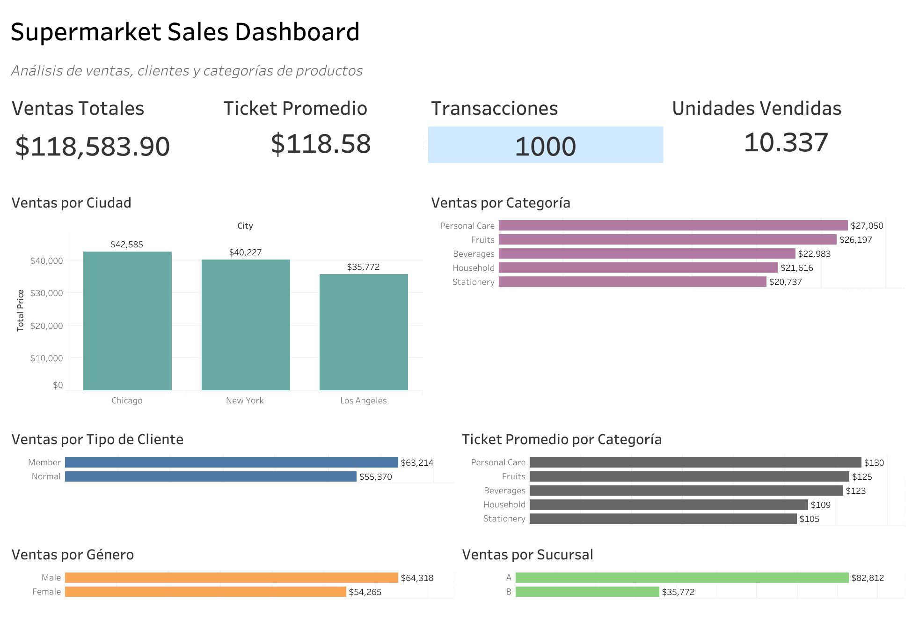

# Supermarket Sales Dashboard

## Descripción del Proyecto

Este proyecto presenta un dashboard interactivo desarrollado en Tableau Public para analizar el desempeño de ventas de un supermercado.

El objetivo es transformar datos transaccionales en información útil para la toma de decisiones mediante indicadores clave (KPIs) y visualizaciones intuitivas que permitan identificar patrones de comportamiento en clientes, productos y sucursales.

---

## Objetivos del Análisis

- Analizar las ventas totales generadas por el supermercado.
- Calcular el ticket promedio por transacción.
- Medir el volumen total de transacciones realizadas.
- Evaluar las unidades vendidas.
- Comparar el desempeño entre ciudades.
- Identificar las categorías de productos con mayores ingresos.
- Analizar el comportamiento de distintos tipos de clientes.
- Comparar las ventas por género.
- Evaluar el rendimiento de las sucursales.

---

## Herramientas Utilizadas

- Tableau Public
- Microsoft Excel / CSV
- Git
- GitHub

---

## Indicadores Principales

| Indicador | Valor |
|-----------|---------|
| Ventas Totales | $118,583.90 |
| Ticket Promedio | $118.58 |
| Transacciones | 1,000 |
| Unidades Vendidas | 10,337 |

---

## Visualizaciones Incluidas

### Ventas por Ciudad

Comparación del volumen de ventas entre:

- Chicago
- New York
- Los Angeles

### Ventas por Categoría

Análisis de ingresos generados por cada categoría de producto:

- Personal Care
- Fruits
- Beverages
- Household
- Stationery

### Ticket Promedio por Categoría

Comparación del valor promedio de compra por categoría para identificar los productos con mayor contribución por transacción.

### Ventas por Tipo de Cliente

Comparación de ventas entre clientes:

- Member
- Normal

### Ventas por Género

Distribución de ventas entre clientes masculinos y femeninos.

### Ventas por Sucursal

Comparación del desempeño comercial de las sucursales A y B.

---

## Dashboard

---

## Tableau Public

Dashboard interactivo:

https://public.tableau.com/views/Supermarket_Sales_Dashboard_17796895590500/Dashboard

---

## Dataset

El conjunto de datos contiene información de ventas de supermercado, incluyendo variables como:

- Ciudad
- Tipo de cliente
- Género
- Categoría de producto
- Nombre del producto
- Cantidad vendida
- Precio unitario
- Impuestos
- Precio total
- Puntos de recompensa

---

## Principales Hallazgos

- La ciudad de Chicago presentó el mayor volumen de ventas.
- La categoría Personal Care generó los mayores ingresos.
- Los clientes Member realizaron compras por un valor superior al grupo Normal.
- La sucursal A registró un desempeño significativamente superior a la sucursal B.
- El ticket promedio se mantuvo relativamente estable entre categorías, con Personal Care liderando el ranking.

---

## Autor

**Cristian Gálvez Ville**  
Data Analyst Junior

### Contacto

- GitHub: https://github.com/TenguRonin
- LinkedIn: https://www.linkedin.com/in/adrian-ville-dataanalyst

---

## Repositorio

Este proyecto forma parte de mi portafolio de análisis de datos y tiene como objetivo demostrar habilidades en:

- Análisis exploratorio de datos (EDA)
- Visualización de información
- Diseño de dashboards
- Storytelling con datos
- Uso de Tableau Public para análisis de negocio